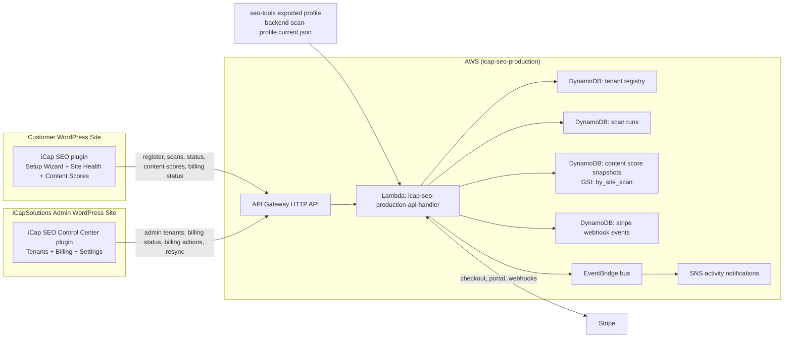

# iCap SEO architecture (production phase-close snapshot)
## Objective
Define the current end-to-end system from customer plugin onboarding through backend scan persistence and provider/admin control-center operations.
## Current production components
- **Customer WordPress plugin (`iCap-SEO`)**
  - Admin UI tabs: Home, Setup Wizard, Site Health, Content Scores, Settings
  - Registration (`site_id`, `site_token` provisioning) and scan trigger/status flow
  - Billing status/checkout/portal actions and entitlement-aware scan blocking
- **Provider/admin WordPress plugin (`iCap-SEO-control-center`, private)**
  - Internal iCapSolutions operations UI: Overview, Tenants, Billing, Settings
  - Admin-token access to tenant and billing views
  - Guarded write actions (billing resync, checkout session, portal session) with audit logging
- **Backend API + runtime (`infrastructure/environments/icap-seo-production`)**
  - API Gateway HTTP routes backed by Lambda `icap-seo-production-api-handler`
  - Billing + entitlement logic with Stripe integrations
  - Scan execution logic driven by exported backend scan profile
  - Activity events via EventBridge and SNS notifications
- **Persistence (DynamoDB)**
  - Tenant registry
  - Scan runs
  - Content score snapshots (`by_site_scan` GSI)
  - Stripe webhook events (idempotency + audit)
- **Scan profile source-of-truth (`seo-tools`)**
  - Canonical profile JSON and exporter script
  - Exported artifact consumed by backend runtime
## Network/component diagram

## End-to-end workflow (start to finish)
1. Customer installs and configures the public `iCap SEO` plugin with API base URL and registration token.
2. Setup Wizard calls `POST /v1/sites/register`; backend returns `site_id` and `site_token`.
3. Customer activates billing from plugin Settings (`checkout-session`/`portal-session`); Stripe webhooks update backend entitlement state.
4. Customer triggers a scan with `POST /v1/sites/{site_id}/scans`.
5. Lambda loads the exported backend scan profile and executes deterministic scoring stages (page, technical, content, schema, images, links).
6. Backend persists scan run metadata to `scan-runs` and per-content score snapshots to `content-score-snapshots`.
7. Customer plugin reads results:
   - scan status from `GET /v1/sites/{site_id}/scans/{scan_id}`
   - content list from `GET /v1/sites/{site_id}/content-scores`
   - content history from `GET /v1/sites/{site_id}/content-scores/{content_key}`
8. Provider/admin users in Control Center monitor tenants/billing and run guarded admin actions through admin endpoints.
9. Backend emits activity events to EventBridge/SNS for operational visibility.
## Endpoint groups in active use
- **Customer plugin paths**
  - `POST /v1/sites/register`
  - `POST /v1/sites/{site_id}/scans`
  - `GET /v1/sites/{site_id}/scans/{scan_id}`
  - `GET /v1/sites/{site_id}/content-scores`
  - `GET /v1/sites/{site_id}/content-scores/{content_key}`
  - `GET /v1/billing/subscription-status`
  - `POST /v1/billing/checkout-session`
  - `POST /v1/billing/portal-session`
- **Control-center/admin paths**
  - `GET /v1/admin/tenants`
  - `POST /v1/admin/billing/resync`
  - `GET /v1/billing/subscription-status` (admin-token context)
  - `POST /v1/billing/checkout-session` (site-scoped admin action)
  - `POST /v1/billing/portal-session` (site-scoped admin action)
## Repo ownership boundaries
- `iCap-SEO`: customer plugin behavior and customer-facing docs.
- `iCap-SEO-control-center` (private): provider/admin operations tooling.
- `infrastructure`: backend runtime + AWS infrastructure + deploy workflow.
- `seo-tools`: canonical backend scan profile/service-definition source and export tooling.
## Phase-close status
- Profile-driven backend scans are live and no longer placeholder-based.
- Scan runs and content score history are persisted in DynamoDB and returned by API routes.
- Terraform workflow-based apply path is validated for this deployment line.
- Cross-repo docs are synchronized for plugin, backend, and control-center operational understanding.
## Related docs
- Customer onboarding guide: `docs/customer-onboarding.md`
- Current status + handoff: `docs/project-handoff-status.md`
- Active execution tracker: `docs/next-steps.md`
- Service boundaries: `docs/service-boundaries.md`
- Infrastructure runbook sections: `../../infrastructure/README.md`
